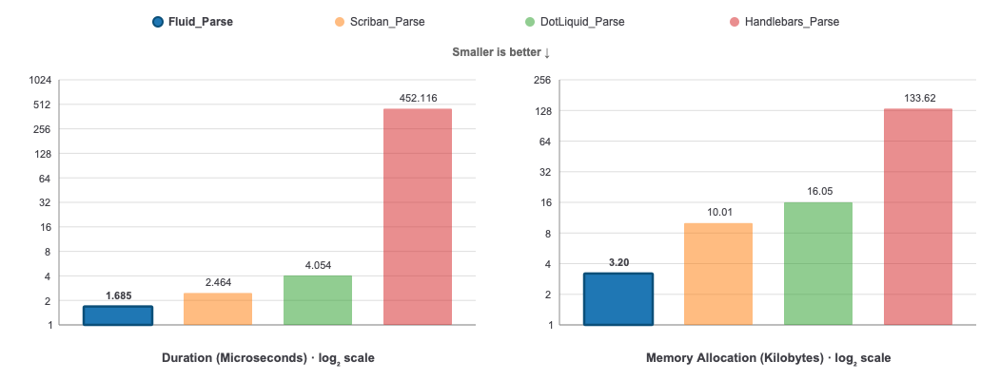
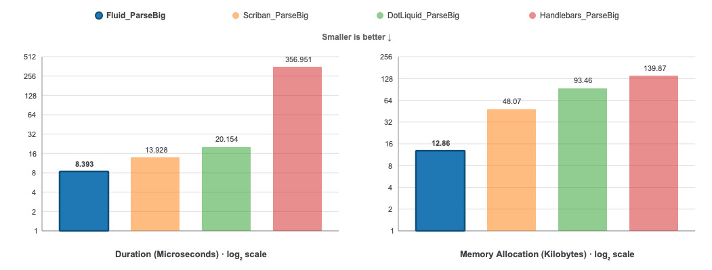
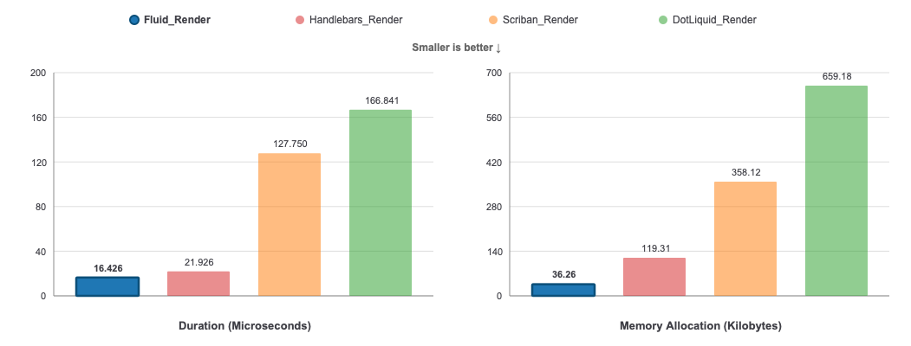

<p align="center"></p>

[](https://nuget.org/packages/Fluid.Core)
[](https://github.com/sebastienros/fluid/blob/main/LICENSE)
[](https://www.myget.org/feed/fluid/package/nuget/fluid.core)

## Basic Overview

Fluid is an open-source .NET template engine based on the [Liquid template language](https://shopify.github.io/liquid/). It is a **secure** template language that is also **very accessible** for non-programmer audiences.

> The following content is based on the 2.0.0-beta version, which is the recommended version, even though some of its API might vary significantly.
> To see the corresponding content for v1.0, use [this version](https://github.com/sebastienros/fluid/blob/release/1.x/README.md)

<br>

## Tutorials

[Deane Barker](https://deanebarker.net) wrote a [very comprehensive tutorial](https://deanebarker.net/tech/fluid/) on how to write Liquid templates with Fluid.
For a high-level overview, read [The Four Levels of Fluid Development](https://deanebarker.net/tech/fluid/intro/), which describes different stages of using Fluid.

<br>

## Features

- Very fast Liquid parser and renderer (no-regexp), with few allocations. See [benchmarks](#performance).
- Secure templates by allow-listing all available properties in the template. User templates can't break your application.
- Supports **async** filters. Templates can execute database queries more efficiently under load.
- Customize filters and tags with your own, even with complex grammar constructs. See [Customizing tags and blocks](#customizing-tags-and-blocks).
- Parses templates into a concrete syntax tree that lets you cache, analyze, and alter the templates before they are rendered.
- Register any .NET types and properties, or define **custom handlers** to intercept when a named variable is accessed.

<br>

## Contents
- [Features](#features)
- [Using Fluid in your project](#using-fluid-in-your-project)
- [NativeAOT and trimming](#nativeaot-and-trimming)
- [Source generator](#source-generator)
- [Allow-listing object members](#allow-listing-object-members)
- [Handling undefined variables](#handling-undefined-variables)
- [Execution limits](#execution-limits)
- [Converting CLR types](#converting-clr-types)
- [Encoding](#encoding)
- [Localization](#localization)
- [Money filters](#money-filters)
- [Time zones](#time-zones)
- [Customizing tags and blocks](#customizing-tags-and-blocks)
- [ASP.NET MVC View Engine](#aspnet-mvc-view-engine)
- [Whitespace control](#whitespace-control)
- [Custom filters](#custom-filters)
- [Functions](#functions)
- [Visiting and altering a template](#visiting-and-altering-a-template)
- [Performance](#performance)
- [Used by](#used-by)

<br>

#### Source

```Liquid
<ul id="products">
  
    <li>
      <h2>{{product.name}}</h2>
      Only {{product.price | price }}

      {{product.description | prettyprint | paragraph }}
    </li>
  
</ul>
```

#### Result

```html
<ul id="products">
    <li>
      <h2>Apple</h2>
      $329

      Flat-out fun.
    </li>
    <li>
      <h2>Orange</h2>
      $25

      Colorful. 
    </li>
    <li>
      <h2>Banana</h2>
      $99

      Peel it.
    </li>
</ul>
```

Notice
- The `<li>` tags are at the same index as in the template, even though the `{% for }` tag had some leading spaces
- The `<ul>` and `<li>` tags are on contiguous lines even though the `{% for }` is taking a full line.

<br>

## Using Fluid in your project

You can directly reference the [NuGet package](https://www.nuget.org/packages/Fluid.Core).

The code samples in this document assume you have registered the `Fluid` namespace with `using Fluid;`.

### Hello World

#### Source

```csharp
var parser = new FluidParser();

var model = new { Firstname = "Bill", Lastname = "Gates" };
var source = "Hello {{ Firstname }} {{ Lastname }}";

if (parser.TryParse(source, out var template, out var error))
{   
    var context = new TemplateContext(model);

    Console.WriteLine(template.Render(context));
}
else
{
    Console.WriteLine($"Error: {error}");
}
```

#### Result
`Hello Bill Gates`

### Model security

Fluid templates can read public properties and fields from the model and from objects reachable through it. This is by design; a model passed to `TemplateContext` should be treated as the template's readable data boundary.

When rendering an untrusted template, pass a dedicated model that contains only the data the template is allowed to read. Do not pass domain entities, service objects, configuration objects, or other object graphs that may expose sensitive data through public members.

### Thread-safety

A `FluidParser` instance is thread-safe and should be shared by the whole application. A common pattern is to declare the parser in a local static variable:

```c#
    private static readonly FluidParser _parser = new FluidParser();
```

An `IFluidTemplate` instance is thread-safe and can be cached and reused by multiple threads concurrently.

A `TemplateContext` instance is __not__ thread-safe, and a new instance should be created every time an `IFluidTemplate` instance is used.

<br>

## NativeAOT and trimming

Fluid works when targeting NativeAOT and trimmed deployments.

- If dynamic code is not supported at runtime, Fluid automatically switches to reflection-based member accessors.
- Existing `MemberAccessStrategy.Register<T...>` APIs are preserved.
- No interceptor setup is required.

### Recommended usage when targeting NativeAOT

1. Reuse `TemplateOptions` instances (for example, at app startup).
2. If you use runtime `MemberAccessStrategy.Register<T...>` calls, execute them during application startup before rendering templates.
3. Prefer `[FluidRegister]` on a custom `TemplateOptions` subclass for model types known at compile time.
4. Validate your app with AOT/trim publish settings:

```shell
dotnet publish -c Release -r <RID> -p:PublishAot=true
```

### Source generation (optional)

When the `Fluid.SourceGenerator` analyzer is enabled, Fluid can generate strongly-typed member accessors for types declared with `FluidRegisterAttribute`.

The recommended pattern is to declare a custom `TemplateOptions` subclass and add one `FluidRegisterAttribute` per model type:

```csharp
using Fluid;

[FluidRegister(typeof(Person))]
[FluidRegister(typeof(Address))]
public partial class PublicTemplateOptions : TemplateOptions
{
}
```

Use the generated options type like any other `TemplateOptions` instance:

```csharp
var options = new PublicTemplateOptions();
```

The generated registrations are instance-scoped and are applied automatically to each `PublicTemplateOptions` instance. Runtime registrations still work and can be added normally:

```csharp
options.MemberAccessStrategy.Register<Product, object>((product, name) => product.Name);
```

Alternatively, explicit profile methods can apply generated registrations to any `TemplateOptions` instance:

```csharp
public static partial class FluidProfiles
{
    [FluidRegister(typeof(Person))]
    [FluidRegister(typeof(Address))]
    public static partial void ApplyPublic(TemplateOptions options);
}
```

Use it with any options instance:

```csharp
var options = new TemplateOptions();
FluidProfiles.ApplyPublic(options);
```

<br>

## Source generator

Fluid includes a Roslyn source generator (project: `Fluid.SourceGenerator`) that can compile Liquid templates at build time and expose them as strongly-typed static properties.

This is useful when you want:

- Parse errors to fail the build.
- Startup-time and runtime parsing eliminated.
- Easy access to templates via generated members.

### MSBuild setup

1) Reference the generator as an analyzer.

If you use a project reference:

```xml
<ItemGroup>
  <ProjectReference Include="../Fluid.SourceGenerator/Fluid.SourceGenerator.csproj"
                    OutputItemType="Analyzer"
                    ReferenceOutputAssembly="false" />
</ItemGroup>
```

2) Provide templates to the generator using `AdditionalFiles`.

```xml
<ItemGroup>
  <AdditionalFiles Include="Templates/**/*.liquid" />
</ItemGroup>
```

3) (Optional) Set the templates root folder.

When set, the generator:

- Only considers `AdditionalFiles` under this folder.
- Matches glob patterns relative to that folder.

```xml
<PropertyGroup>
  <FluidTemplatesFolder>Templates</FluidTemplatesFolder>
</PropertyGroup>
```

### Usage

Annotate a `partial` class with `FluidTemplates`, using include and optional exclude glob patterns. Each matching file generates a dedicated static property returning an `IFluidTemplate`.

```csharp
using Fluid.SourceGenerator;

namespace MyApp;

[FluidTemplates("**/*.liquid", Exclude = new[] { "_*.liquid" })]
public static partial class Templates
{
}
```

With templates like:

- `Templates/hello.liquid`
- `Templates/_layout.liquid`

The generator will create:

- `Templates.Hello` (compiled from `hello.liquid`)

### Glob patterns

The generator supports a simple glob syntax:

- `*` matches within a path segment.
- `?` matches a single character within a path segment.
- `**` matches across directories (e.g. `**/*.liquid`).

Multiple include patterns are supported via the attribute constructor:

```csharp
[FluidTemplates("**/*.liquid", "**/*.txt")]
```

### Notes

- Property names are derived from the file name (without extension) and converted to PascalCase. If multiple files would produce the same property name, a numeric suffix is appended.
- `` dependencies are resolved against the same set of `AdditionalFiles` (the generator also registers `.liquid` templates without the extension for convenience).
- Source-generated templates currently require `TemplateOptions.Trimming` to be `TrimmingFlags.None`.

<br>

## Adding custom filters

Filters can be **async** or not. They are defined as a `delegate` that accepts an **input**, a **set of arguments** and the current **context** of the rendering process.

Here is the `downcase` filter as defined in Fluid.

#### Source
```csharp
public static ValueTask<FluidValue> Downcase(FluidValue input, FilterArguments arguments, TemplateContext context)
{
    return new StringValue(input.ToStringValue().ToLower());
}
```

#### Registration
Filters are registered in an instance of `TemplateOptions`. This options object can be reused every time a template is rendered.

```csharp
var options = new TemplateOptions();
options.Filters.AddFilter('downcase', Downcase);

var context = new TemplateContext(options);
```

<br>

## Altering exposed .NET properties

### Converting object types

Use the `ValueConverters` property to return different values than those provided by the model classes and properties:

```csharp
var options = new TemplateOptions();
options.ValueConverters.Add(o => o is DateTime d ? new StringValue($"This is a date time: {d}") : null);
```

The previous example will return a custom value instead of the actual `DateTime`. When no conversion should be applied, `null` is returned.

### Customizing object properties

A common scenario is to access named properties on an object that do not exist in the source class, or should return a different result.

In this case, the `ValueConverters` can be used to return a specific wrapper/proxy `FluidValue` instance.
In practice, you can inherit from `ObjectValueBase` as it implements how most objects should behave.

The following example shows how to provide a custom transformation for any `Person` object:

```csharp
private class PersonValue : ObjectValueBase
{
    public PersonValue(Person value) : base(value)
    {
    }

    public override ValueTask<FluidValue> GetValueAsync(string name, TemplateContext context)
    {
        if (name == "Bingo")
        {
          return new StringValue("Hello, World!");
        }
    }
}
```

This custom type can be used with a converter so that any time a `Person` is used, it is wrapped as a `PersonValue`.

```csharp
var options = new TemplateOptions();
options.ValueConverters.Add(o => o is Person p ? new PersonValue(p) : null);
```

Invoking the member `Bingo` on a `Person` instance will then return the string `"Hello, World!"`:

```liquid
{{ myPerson.Bingo }}
```

> Note: This technique can also be used to substitute existing properties with other values or even computed data.

<br>

## Handling undefined values

Fluid evaluates members lazily, so undefined identifiers can be detected precisely when they are consumed. By default, undefined values render as empty strings without raising errors.

### Tracking undefined values

To track missing values during template rendering, assign a delegate to `TemplateOptions.Undefined` or `TemplateContext.Undefined`. This delegate is called each time an undefined variable is accessed and receives the variable path and parent object type. The `type` argument is `null` when there is no target object (for example, when a global value is missing).

```csharp
var missingVariables = new List<string>();

var context = new TemplateContext();
context.Undefined = (name, type) =>
    {
        missingVariables.Add(name);
        return ValueTask.FromResult<FluidValue>(NilValue.Instance);
    }
};

var template = FluidTemplate.Parse("Hello {{ user.name }} in {{ city }}!");

await template.RenderAsync(context);

### Strict variables

If you prefer templates to fail fast when they reference a variable that does not exist, enable strict variable mode by setting `TemplateOptions.StrictVariables` to `true`. When `StrictVariables` is `true`, any attempt to access an undefined variable throws a `FluidException` containing the variable name. This makes missing data issues visible immediately instead of silently rendering as an empty string.

```csharp
var options = new TemplateOptions { StrictVariables = true };
var context = new TemplateContext(options);

// Parsing a template that references an undefined variable
var template = FluidTemplate.Parse("Hello {{ user.name }}!");

// Throws FluidException: Undefined variable 'user'
await template.RenderAsync(context);
```

When `StrictVariables` is disabled (the default), you can still track missing variables using the `Undefined` delegate described above, or provide fallback values by returning a custom `FluidValue`.

// missingVariables now contains ["user.name", "city"]
```

### Strict filters

By default, applying an unknown filter simply returns the input value unchanged:

```liquid
{{ 'hello' | unknown }}  => hello
```

If you would rather fail fast when a template references a filter that has not been registered, enable strict filter mode by setting `TemplateOptions.StrictFilters` to `true`:

```csharp
var options = new TemplateOptions { StrictFilters = true };
var context = new TemplateContext(options);

var template = FluidTemplate.Parse("{{ 'hello' | unknown }}");
// Throws FluidException: Undefined filter 'unknown'
await template.RenderAsync(context);
```

Known filters continue to work normally when `StrictFilters` is enabled:

```liquid
{{ 'hello' | upcase }}  => HELLO
```

Use `StrictFilters` together with `StrictVariables` to enforce both variable and filter correctness during authoring.

### Returning custom values for undefined values

The `Undefined` delegate can return a custom `FluidValue` to provide fallback values or error messages for missing values:

```csharp
var options = new TemplateOptions
{
    Undefined = (name, type) =>
    {
        // Return a custom default value for undefined variables
        return ValueTask.FromResult<FluidValue>(new StringValue($"[{name} not found]"));
    }
};

var template = FluidTemplate.Parse("Hello {{ user.name }} in {{ city }}!");
var context = new TemplateContext(options);

var result = await template.RenderAsync(context);
// Outputs: "Hello [user.name not found] in [city not found]!"
```

### Logging undefined accesses

You can use the `Undefined` delegate to log missing values for debugging or monitoring:

```csharp
var options = new TemplateOptions
{
    Undefined = (path, type) =>
    {
        Console.WriteLine($"Missing variable: {path}, parent type: {type?.Name ?? "<none>"}");
        return ValueTask.FromResult<FluidValue>(NilValue.Instance);
    }
};

var template = FluidTemplate.Parse("{{ first }} {{ second }}");
var context = new TemplateContext(options);
await template.RenderAsync(context);
// Logs: "Missing variable: first"
// Logs: "Missing variable: second"
```

### Object members casing

By default, the properties of a registered object are case-sensitive and registered as they are in their source code. For instance, 
the property `FirstName` would be accessed using the `{{ p.FirstName }}` tag.

However, you can register these properties with different cases, like __camelCase__ (`firstName`), __snake_case__ (`first_name`), or even make them case-insensitive. The `ModelNamesComparer` option accepts an instance of `System.StringComparer`.

The following example configures the templates to use camel casing.

```csharp
var options = new TemplateOptions() 
{ 
    ModelNamesComparer = StringComparers.CamelCase
}
```

With this setting, both model properties and context properties are accessible using camel-casing:

```liquid
{{ firstName }} {{ lastName }}
```

### Loading templates asynchronously

`TemplateOptions.FileProvider` uses the asynchronous `ITemplateFileProvider` contract. Templates stored in a remote service can be loaded without blocking:

```csharp
var options = new TemplateOptions
{
    FileProvider = new DelegateTemplateFileProvider(async (path, context, cancellationToken) =>
    {
        var metadata = await templateStore.GetMetadataAsync(path, cancellationToken);
        if (metadata is null)
        {
            return null;
        }

        return new TemplateSourceInfo(
            metadata.LastModified,
            async cancellationToken => await templateStore.OpenReadAsync(path, cancellationToken),
            cacheKey: $"{tenantId}:{path}");
    })
};

var context = new TemplateContext(options)
{
    CancellationToken = requestAborted
};
var result = await template.RenderAsync(context);
```

The provider returns `null` when a path does not exist. Fluid tries the requested path first, then appends `DefaultFileExtension` when necessary.

Fluid calls the provider to obtain the source version before checking its parsed-template cache. The stream is opened only on a cache miss. `LastModified` must advance whenever the content changes; remote implementations can cache metadata themselves if checking it requires a network request. When a provider can return different content for the same path in different contexts, set `TemplateSourceInfo.CacheKey` to a stable value that includes the tenant or other source identity.

Static `` paths can skip provider resolution after the first load when the provider also implements `IVersionedTemplateFileProvider`. Publish source changes before incrementing its monotonic `Version` whenever any source's existence, content, `LastModified`, `CacheKey`, or path resolution changes. `GetTemplateResolutionCacheKey` returns a stable object identity for contexts that see the same sources, or `null` to disable this optimization for a context. Fluid still checks `TemplateCache` on every render, so custom cache expiration remains authoritative. Providers without these guarantees, and options with a `null` `TemplateCache`, retain provider resolution on every render.

Existing `Microsoft.Extensions.FileProviders.IFileProvider` implementations can be adapted:

```csharp
options.FileProvider = new FileProviderTemplateFileProvider(existingFileProvider);
```

`FluidViewEngineOptions.ViewsFileProvider` and `PartialsFileProvider` use the same asynchronous contract for views, layouts, `_ViewStart` files, and partials. ASP.NET Core MVC view-name discovery remains synchronous because `IViewEngine.FindView` has no asynchronous contract; configure `FluidMvcViewOptions.ViewLocationFileProvider` with an `IFileProvider` for that lookup.

Always use `RenderAsync` with an asynchronous provider. The synchronous `Render` APIs must block if the provider suspends.

`TemplateContext.CancellationToken` is also checked at render entry, between statements, on loop iterations and built-in array enumeration, and before buffered output is flushed. Custom filters and `FluidValue` implementations receive the context and should check the token during long-running work.

<br>

## Execution limits

### Limiting template recursion

When invoking `` statements, it is possible that some templates create an infinite recursion that could block the server.
To prevent this, the `TemplateOptions` class defines a default `MaxRecursion = 100` that prevents templates from having a depth greater than `100`.

### Limiting template execution

A template can inadvertently perform enough work to block the server. `MaxSteps` limits statements, loop iterations, range construction, and built-in collection enumeration. `MaxOutputSize` limits cumulative rendered output, captured blocks, macro results, and amplified string operations. `MaxCollectionSize` limits ranges and collections materialized by built-in operations.

`MaxSteps`, `MaxOutputSize`, and `MaxCollectionSize` are unlimited by default to preserve compatibility. Set all of them when rendering untrusted templates. `TemplateContext.CancellationToken` complements these limits and should also be set.

### Rendering user-provided templates safely

Fluid is a template engine, not a security sandbox. An application that accepts templates from users should apply all of the following controls:

1. Limit the template source length before parsing. Render limits do not limit parsing.
2. Pass a dedicated model containing only data the user is allowed to read. Templates can read public properties and fields from every object reachable through the model. Do not pass domain entities, services, dependency-injection containers, configuration, or secrets.
3. Configure recursion, work, output, and collection limits. The appropriate values depend on the templates and capacity of the application; start conservatively and adjust using representative load tests.
4. Set a per-render cancellation deadline in addition to the request cancellation token.
5. Keep the default null file provider unless user templates need `include`, `render`, or `from`. If they do, use a tenant-scoped or allow-listed provider that cannot access application files or another tenant's templates.
6. Expose only trusted custom filters, tags, values, and file providers. Extension code executes with the permissions of the application and must honor cancellation and equivalent resource limits.
7. Apply normal service protections such as request-size limits, authentication, rate limits, bounded concurrency, and memory or process isolation where the threat model requires it.

The following is an example starting point. The numerical limits are illustrative and should be tuned for the application:

```csharp
private const int MaxTemplateLength = 100_000;

private static readonly FluidParser Parser = new FluidParser();

private static readonly TemplateOptions UserTemplateOptions = new TemplateOptions
{
    MaxRecursion = 20,
    MaxSteps = 10_000,
    MaxOutputSize = 1_000_000,
    MaxCollectionSize = 10_000
    // FileProvider retains its default NullFileProvider.
};

public static async ValueTask<string> RenderUserTemplateAsync(
    string source,
    SafeTemplateModel model,
    CancellationToken requestAborted)
{
    if (source.Length > MaxTemplateLength)
    {
        throw new ArgumentException("The template is too large.", nameof(source));
    }

    if (!Parser.TryParse(source, out var template, out var error))
    {
        throw new ArgumentException(error, nameof(source));
    }

    using var timeout = CancellationTokenSource.CreateLinkedTokenSource(requestAborted);
    timeout.CancelAfter(TimeSpan.FromSeconds(2));

    var context = new TemplateContext(model, UserTemplateOptions)
    {
        CancellationToken = timeout.Token
    };

    return await template.RenderAsync(context);
}
```

`TemplateOptions`, `FluidParser`, and parsed templates can be shared. Create a new `TemplateContext` for every render because it is not thread-safe and owns the execution counters and cancellation token.

When a file provider can return different content for the same path in different tenants or security scopes, set `TemplateSourceInfo.CacheKey` to a stable value that includes that scope. This prevents a cached parsed template from crossing the same boundary enforced by the provider.

`MaxOutputSize` counts UTF-16 characters written through Fluid's output abstraction. If the rendered result is encoded to a response with a separate byte limit, enforce that transport limit as well. Custom filters, values, tags, and output implementations are responsible for enforcing equivalent limits for work they perform outside Fluid's built-in operations.

<br>

## Converting CLR types

Whenever an object is manipulated in a template, it is converted to a specific `FluidValue` instance that provides a dynamic type system somewhat similar to the one in JavaScript.

In Liquid, they can be Number, String, Boolean, Array, Dictionary, or Object. Fluid will automatically convert the CLR types to the corresponding Liquid ones, and also provides specialized ones.

To customize this conversion, you can add **value converters**.

### Adding a value converter

When the conversion logic is not directly inferred from the type of an object, a value converter can be used.

Value converters can return:
- `null` to indicate that the value couldn't be converted
- a `FluidValue` instance to stop any further conversion and use this value
- another object instance to continue the conversion using custom and internal **type mappings**

The following example shows how to convert any instance implementing an interface to a custom string value:

```csharp
var options = new TemplateOptions();

options.ValueConverters.Add((value) => value is IUser user ? user.Name : null);
```

> Note: Type mappings are defined globally for the application.

<br>

## Encoding

By default, Fluid doesn't encode the output. Encoders can be specified when calling `Render()` or `RenderAsync()` on the template.

### HTML encoding

To render a template with HTML encoding, use the `System.Text.Encodings.Web.HtmlEncoder.Default` instance.

This encoder is used by default for the MVC View engine.

### Disabling encoding contextually

When an encoder is defined, you can use a special `raw` filter or ` ... ` tag to prevent a value from being encoded, for instance if you know that the content is HTML and is safe.

#### Source
```Liquid


Encoded: {{ html }}
Not encoded: {{ html | raw }
```

#### Result
```html
&lt;em%gt;This is some html&lt;/em%gt;
<em>This is some html</em>
```

### Captured blocks are not double-encoded

When using `capture` blocks, the inner content is flagged as 
pre-encoded and won't be double-encoded if used in a `{{ }}` tag.

### Customizing JSON output

The `json` filter uses `System.Text.Json.JsonSerializerOptions` to control the JSON output format. You can customize these options through `TemplateOptions.JsonSerializerOptions` or `TemplateContext.JsonSerializerOptions`.

#### Example: Indented JSON output

```csharp
var options = new TemplateOptions
{
    JsonSerializerOptions = new JsonSerializerOptions
    {
        WriteIndented = true
    }
};

var context = new TemplateContext(options);
context.SetValue("data", new { name = "John", age = 30 });
```

```Liquid
{{ data | json }}
```

#### Result
```json
{
  "name": "John",
  "age": 30
}
```

You can also set `JsonSerializerOptions` per `TemplateContext`, but it is recommended to reuse `JsonSerializerOptions` instances and define them in a `TemplateOptions` instance that can be reused across `TemplateContext` instances.

### JSON encoding

By default, all JSON strings are encoded using the default `JavaScriptEncoder` instance. This can be changed by setting the `JsonSerializerOptions.JavaScriptEncoder` property to `JavaScriptEncoder.UnsafeRelaxedJsonEscaping`.

```Liquid
{{ "你好，这是一条短信" | json" }}
```

With the default JSON encoder:

```html
"\u4F60\u597D\uFF0C\u8FD9\u662F\u4E00\u6761\u77ED\u4FE1"
```

Using the relaxed JSON encoding:

```csharp
// This variable should be static and reused for all template contexts
var options = new TemplateOptions
{
    JsonSerializerOptions = new JsonSerializerOptions
    {
        JavaScriptEncoder = JavaScriptEncoder.UnsafeRelaxedJsonEscaping
    }
    
};

var context = new TemplateContext(options);
```

Result:

```html
"你好，这是一条短信"
```

<br>

## Localization

By default, templates are rendered using an _invariant_ culture so that the results are consistent across systems. This is important, for instance, when rendering dates, times, and numbers.

However, you can define a specific culture to use when rendering a template using the `TemplateContext.CultureInfo` property. 

#### Source

```csharp
var options = new TemplateOptions();
options.CultureInfo = new CultureInfo("en-US");
var context = new TemplateContext(options);
var result = template.Render(context);
```

```Liquid
{{ 1234.56 }}
{{ "now" | date: "%v" }}
```

#### Result
```html
1234.56
Tuesday, August 1, 2017
```

<br>

## Money filters

Fluid implements the [Shopify money filters](https://shopify.dev/docs/api/liquid/filters/money). They are not registered by default, add them to the filters of the `TemplateOptions` instance.

```csharp
var options = new TemplateOptions();
options.Filters.WithMoneyFilters();
```

| Filter | Source | Result |
| --- | --- | --- |
| `money` | `{{ 1134.65 \| money }}` | `$1,134.65` |
| `money_with_currency` | `{{ 1134.65 \| money_with_currency }}` | `$1,134.65 USD` |
| `money_without_currency` | `{{ 1134.65 \| money_without_currency }}` | `1,134.65` |
| `money_without_trailing_zeros` | `{{ 10.00 \| money_without_trailing_zeros }}` | `$10` |

Amounts are rounded away from zero, so `10.005` is rendered as `$10.01`.

### Cultures and currencies

By default, the currency and the way amounts are formatted are derived from `TemplateOptions.CultureInfo`. The default culture is the invariant one, which has no currency, in which case `USD` is used.

```csharp
options.CultureInfo = new CultureInfo("de-DE");
```

```Liquid
{{ 1134.65 | money_with_currency }}
```

```html
1.134,65 € EUR
```

A specific currency can be set with `MoneyOptions.Currency`, using its [ISO 4217](https://en.wikipedia.org/wiki/ISO_4217) code. It is also accepted as an argument of every money filter, which is useful when a single template renders multiple currencies.

```csharp
options.MoneyOptions.Currency = "EUR";
```

```Liquid
{{ 10 | money }}
{{ 10 | money: 'GBP' }}
{{ 10 | money: currency: 'JPY' }}
```

```html
€10.00
£10.00
¥10
```

The symbol and the number of decimal digits of the most common currencies are known to Fluid. Others can be added, or replaced, in `MoneyOptions.Currencies`. A currency that is not registered is rendered using its code as the symbol.

```csharp
options.MoneyOptions.Currencies["BTC"] = new MoneyCurrency("BTC", "₿", decimalDigits: 8);
```

### Amounts stored in cents

Shopify stores prices as integers representing cents. Set `MoneyOptions.AmountsInCents` to divide the input of the money filters by 100, which makes it possible to reuse Shopify templates as-is.

```csharp
options.MoneyOptions.AmountsInCents = true;
```

```Liquid
{{ 1450 | money }}
```

```html
$14.50
```

### Custom formats

`MoneyOptions.MoneyFormat` and `MoneyOptions.MoneyWithCurrencyFormat` override the culture based formatting, using the same placeholders as the [Shopify currency formatting settings](https://help.shopify.com/en/manual/payments/currency-formatting). These placeholders are culture independent.

| Placeholder | Result for `1134.65` |
| --- | --- |
| `{{amount}}` | `1,134.65` |
| `{{amount_no_decimals}}` | `1,135` |
| `{{amount_with_comma_separator}}` | `1.134,65` |
| `{{amount_no_decimals_with_comma_separator}}` | `1.135` |
| `{{amount_with_apostrophe_separator}}` | `1'134.65` |
| `{{amount_no_decimals_with_space_separator}}` | `1 135` |
| `{{amount_with_space_separator}}` | `1 134,65` |
| `{{amount_with_period_and_space_separator}}` | `1 134.65` |
| `{{currency}}` | the ISO 4217 code of the currency, e.g. `USD` |
| `{{currency_symbol}}` | the symbol of the currency, e.g. `$` |

`{{currency}}` and `{{currency_symbol}}` are specific to Fluid, and let a single format be used with the currency that is resolved when the template is rendered. Unknown placeholders are rendered verbatim.

```csharp
options.MoneyOptions.MoneyFormat = "{{amount_with_comma_separator}} kr";
```

```Liquid
{{ 1134.65 | money }}
```

```html
1.134,65 kr
```

`money_without_currency` always renders the amount on its own and ignores these formats. When `MoneyWithCurrencyFormat` is not set, `money_with_currency` uses `MoneyFormat` followed by the currency code.

### Rendering a different currency per request

`MoneyOptions` is application-wide configuration and is expected to be configured once. To use a different currency for a single rendering, assign a `MoneyOptions` instance on the `TemplateContext`.

```csharp
var context = new TemplateContext(options)
{
    MoneyOptions = new MoneyOptions { Currency = "EUR" }
};
```

<br>

## Time zones

> **📖 For a comprehensive guide on working with time zones in Fluid, see [TimeZones.md](TimeZones.md)**

### System time zone

`TemplateOptions` and `TemplateContext` provide a property to define a default time zone to use when parsing dates and times. The default value is the current system's time zone. Setting a custom one can also prevent different environments (data centers) from generating different results.

- When dates and times are parsed and don't specify a time zone, the configured one is assumed. 
- When a time zone is provided in the source string, the resulting date time uses it.

> **Important**: The `TimeZone` property is used for **parsing** date strings, not for automatically converting dates during rendering. To convert dates to a specific timezone for display, use the `time_zone` filter.

> Note: The `date` filter conforms to the Ruby date and time formats https://ruby-doc.org/core-3.0.0/Time.html#method-i-strftime. To use the .NET standard date formats, use the `format_date` filter.

#### Source

```csharp
var context = new TemplateContext { TimeZone = TimeZoneInfo.FindSystemTimeZoneById("Pacific Standard Time") } ;
var result = template.Render(context);
```

```Liquid
{{ '1970-01-01 00:00:00' | date: '%c' }}
```

#### Result
```html
Wed Dec 31 19:00:00 -08:00 1969
```

### Converting time zones

Dates and times can be converted to specific time zones using the `time_zone: <iana>` filter.

#### Example

```csharp
var context = new TemplateContext();
context.SetValue("published", DateTime.UtcNow);
```

```Liquid
{{ published | time_zone: 'America/New_York' | date: '%+' }}
```

#### Result
```html
Tue Aug  1 17:04:36 -05:00 2017
```

<br>

## Customizing tags and blocks

Fluid's grammar can be modified to accept any new tags and blocks with 
any custom parameters. The parser is based on [Parlot](https://github.com/sebastienros/parlot) 
which makes it completely extensible.

Unlike blocks, tags don't have a closing element (e.g., `cycle`, `increment`).
A closing element will match the name of the opening tag with an `end` suffix, like `endfor`.
Blocks are useful when manipulating a section of a template as a set of statements.

Fluid provides helper methods to register common tags and blocks. All tags and blocks always start with an __identifier__ that is the tag name.

Each custom tag needs to provide a delegate that is evaluated when the tag is matched. Each delegate will be able to use these properties:

- `writer`, a `TextWriter` instance that is used to render some text.
- `encode`, a `TextEncoder` instance, like `HtmlEncoder` or `NullEncoder`. It's defined by the caller of the template.
- `context`, a `TemplateContext` instance.

### Registering a custom tag

- __Empty__: Tag with no parameter, like ``
- __Identifier__: Tag taking an identifier as parameter, like ``
- __Expression__: Tag taking an expression as parameter, like ``

Here are some examples:

#### Source

```csharp
parser.RegisterIdentifierTag("hello", (identifier, writer, encoder, context) =>
{
    writer.Write("Hello ");
    writer.Write(identifier);
});
```

```Liquid

```

#### Result
```html
Hello you
```

### Registering a custom block

Blocks are created the same way as tags, and the lambda expression can then access the list of statements inside the block.

#### Source


```csharp

parser.RegisterExpressionBlock("repeat", async (value, statements, writer, encoder, context) =>
{
    var fluidValue = await value.EvaluateAsync(context);

    for (var i = 0; i < fluidValue.ToNumberValue(); i++)
    {
        await statements.RenderStatementsAsync(writer, encoder, context);
    }

    return Completion.Normal;
});
```

```Liquid
Hi! 
```

#### Result
```html
Hi! Hi! Hi!
```

### Custom parsers

If __identifier__, __empty__ and __expression__ parsers are not sufficient, the methods `RegisterParserBlock` and `RegisterParserTag` accept
any custom parser construct. These can be the standard ones defined in the `FluidParser` class, like `Primary`, or any other composition of them.

For instance, `RegisterParseTag(Primary.AndSkip(Comma).And(Primary), ...)` will expect two `Primary` elements separated by a comma. The delegate will then 
be invoked with a `ValueTuple<Expression, Expression>` representing the two `Primary` expressions.

### Registering a custom operator

Operators are used to compare values, like `>` or `contains`. Custom operators can be defined if special comparisons need to be provided.

#### Source

The following example creates a custom `xor` operator that will evaluate to `true` if only one of the left and right expressions is true when converted to booleans.

__XorBinaryExpression.cs__

```csharp
using Fluid.Ast;
using Fluid.Values;
using System.Threading.Tasks;

namespace Fluid.Tests.Extensibility
{
    public class XorBinaryExpression : BinaryExpression
    {
        public XorBinaryExpression(Expression left, Expression right) : base(left, right)
        {
        }

        public override async ValueTask<FluidValue> EvaluateAsync(TemplateContext context)
        {
            var leftValue = await Left.EvaluateAsync(context);
            var rightValue = await Right.EvaluateAsync(context);

            return BooleanValue.Create(leftValue.ToBooleanValue() ^ rightValue.ToBooleanValue());
        }
    }
}
```

__Parser configuration__

```csharp
parser.RegisteredOperators["xor"] = (a, b) => new XorBinaryExpression(a, b);
```

__Usage__

```Liquid
Hello
```

#### Result
```html
Hello
```

## Accessing the concrete syntax tree

The syntax tree is accessible by casting the template to its concrete `FluidTemplate` type and using the `Statements` property.

#### Source

```csharp
var template = (FluidTemplate)iTemplate;
var statements = template.Statements;
```

<br>

## ASP.NET MVC View Engine

The package `Fluid.MvcViewEngine` provides a convenient way to use Liquid as a replacement for, or in combination with, Razor in ASP.NET MVC.

### Configuration

#### Registering the view engine

1. Reference the `Fluid.MvcViewEngine` NuGet package
2. Add a `using` statement on `Fluid.MvcViewEngine`
3. Call `AddFluid()` in your `Startup.cs`.

#### Sample
```csharp
using Fluid.MvcViewEngine;

public class Startup
{
    public void ConfigureServices(IServiceCollection services)
    {
        services.AddMvc().AddFluid();
    }
}
```
#### Registering view models

Because the Liquid language only allows known members to be accessed, the View Model classes need to be registered in Fluid, usually from a static constructor so that the code is run only once for the application.

#### View Model registration

View models are automatically registered and available as the root object in liquid templates.
Custom model registrations can be added when calling `AddFluid()`.

```csharp
public class Startup
{
    public void ConfigureServices(IServiceCollection services)
    {
        services.AddMvc().AddFluid(o => o.TemplateOptions.Register<Person>());
    }
}
```

More ways to register types and members can be found in the [Allow-listing object members](#allow-listing-object-members) section.

#### Registering custom tags

When using the MVC View engine, custom tags can still be added to the parser. Refer to [this section](https://github.com/sebastienros/fluid#registering-a-custom-tag) on how to create custom tags.

It is recommended to create a custom class inheriting from `FluidViewParser`, and to customize the tags in the constructor of this new class.
This class can then be registered as the default parser for the MVC view engine.

```csharp
using Fluid.Ast;
using Fluid.MvcViewEngine;

namespace Fluid.MvcSample
{
    public class CustomFluidViewParser : FluidViewParser
    {
        public CustomFluidViewParser()
        {
            RegisterEmptyTag("mytag", static async (s, w, e, c) =>
            {
                await w.WriteAsync("Hello from MyTag");

                return Completion.Normal;
            });
        }
    }
}
```

```csharp
public class Startup
{
    public void ConfigureServices(IServiceCollection services)
    {
        services.Configure<MvcViewOptions>(options =>
        {
            options.Parser = new CustomFluidViewParser();
        });

        services.AddMvc().AddFluid();
    }
}
```

### Layouts

#### Index.liquid

```Liquid


This is the home page
```

The `` tag accepts one argument which can be any expression that returns the relative location of a Liquid template that will be used as the master template.

The layout tag is optional in a view. It can also be defined multiple times or conditionally.

From a layout template, the `` tag is used to depict the location of the view's content inside the layout itself.

#### Layout.liquid

```Liquid
<html>
  <body>
    <div class="menu"></div>
    
    <div class="content">
      
    </div>
    
    <div class="footer"></div>
  </body>
</html>
```

### Sections

Sections are defined in a layout for views to render content in specific locations. For instance, a view can render some content in a **menu** or a **footer** section.

#### Rendering content in a section

```Liquid


This is the home page


  <a href="h#">This link goes in the menu</a>



  This text will go in the footer

```

#### Rendering the content of a section

```Liquid
<html>
  <body>
    <div class="menu">
      
    </div>
    
    <div class="content">
      
    </div>
    
    <div class="footer">
      
    </div>
  </body>
</html>
```

### ViewStart files

Defining the layout template in each view might be cumbersome and make it difficult to change it globally. To prevent that, it can be defined in a `_ViewStart.liquid` file.

When a view is rendered, all `_ViewStart.liquid` files from its current and parent directories are executed beforehand. This means multiple files can be defined to set settings for a group of views.

#### _ViewStart.liquid

```Liquid

{% assign background = 'ffffff' }
```

You can also define other variables or render some content.

### Custom views locations

It is possible to add custom file locations containing views by adding them to `FluidMvcViewOptions.ViewsLocationFormats`.

The default ones are:
- `Views/{1}/{0}.liquid`
- `Views/Shared/{0}.liquid`

Where `{0}` is the view name, and `{1}` is the controller name.

For partials, the list is defined in `FluidMvcViewOptions.PartialsLocationFormats`:
- `Views/{0}.liquid`
- `Views/Partials/{0}.liquid`
- `Views/Partials/{1}/{0}.liquid`
- `Views/Shared/Partials/{0}.liquid`

Layouts will be searched in the same locations as Views.

### Execution

The content of a view is parsed once and kept in memory until the file or one of its dependencies changes. Once parsed, the tags are executed every time the view is called. In comparison, Razor views are first compiled and then instantiated every time they are rendered. This means that on startup or when the view is changed, views with Fluid will run faster than those in Razor, unless you are using precompiled Razor views. In all cases, Razor views will be faster on subsequent calls as they are compiled directly to C#.

This difference makes Fluid very suitable for rapid development cycles where the views can be deployed and updated frequently. And because the Liquid language is secure, developers can give access to them with more confidence.  

<br>

## View Engine

The Fluid ASP.NET MVC View Engine is based on an MVC-agnostic view engine provided in the `Fluid.ViewEngine` package. The same options and features are available, but without 
requiring ASP.NET MVC. This is useful to provide the same experience when building templates using layouts and sections.

### Usage

Use the class `FluidViewRenderer : IFluidViewRenderer` and `FluidViewEngineOptions`. 


## Whitespace control

Liquid follows strict rules with regard to whitespace support. By default, all spaces and new lines are preserved from the template.
The Liquid syntax and some Fluid options allow you to customize this behavior.

### Hyphens

For example:

```liquid

{{ name }}
```

There is a new line after the `assign` tag which will be preserved.

Outputs:

```

Bill
```

Tags and values can use hyphens to strip whitespace. 

Example:

```liquid

{{ name }}
```

Outputs:

```
Bill
```

The `-%}` strips the whitespace from the right side of the `assign` tag.

## Template Options

Fluid provides the `TemplateOptions.Trimming` property that can be set with predefined preferences for when whitespace should be stripped automatically, even if hyphens are not
present in tags and output values.

## Greedy Mode

When greedy mode is disabled in `TemplateOptions.Greedy`, only the spaces before the first new line are stripped.
Greedy mode is enabled by default since this is the standard behavior of the Liquid language.

<br>

## Custom filters

Some non-standard filters are provided by default:

### format_date

Formats dates and times using standard .NET date and time formats. It uses the current culture of the system.

Input

```
"now" | format_date: "G"
```

Output

```
6/15/2009 1:45:30 PM
```

Documentation: https://docs.microsoft.com/en-us/dotnet/standard/base-types/standard-date-and-time-format-strings

### format_number

Formats numbers using standard .NET number formats.

Input

```
123 | format_number: "N"
```

Output

```
123.00
```

Documentation: https://docs.microsoft.com/en-us/dotnet/standard/base-types/standard-numeric-format-strings

### format_string

Formats custom strings using standard .NET format strings.

Input

```
"hello {0} {1:C}" | format_string: "world" 123
```

Output

```
hello world $123.00
```

Documentation: https://docs.microsoft.com/en-us/dotnet/api/system.string.format

<br>

## Functions

Fluid provides optional support for functions, which is not part of the standard Liquid templating language. As such, it is not enabled by default.

### Enabling functions

When instantiating a `FluidParser`, set the `FluidParserOptions.AllowFunctions` property to `true`.

```
var parser = new FluidParser(new FluidParserOptions { AllowFunctions = true });
```

When functions are used while the feature is not enabled, a parse error will be returned.

### Declaring local functions with the `macro` tag

`macro` allows you to define reusable chunks of content to invoke with a local function.

```

<div class="field">
  <input type="{{ type }}" name="{{ name }}"
         value="{{ value }}" />
</div>

```

Now `field` is available as a local property of the template and can be invoked as a function.

```
{{ field('user') }}
{{ field('pass', type='password') }}
```

> Macros need to be defined before they are used, as they are discovered as the template is executed.

### Importing functions from external templates

Macros defined in an external template **must** be imported before they can be invoked.

```


{{ field('user') }}
{{ field('pass', type='password') }}
```

### Extensibility

Functions are `FluidValue` instances implementing the `InvokeAsync` method. This allows any template to be provided custom function values as part of the model, the `TemplateContext`, or globally with options.

A `FunctionValue` type is also available to provide out-of-the-box functions. It takes a delegate that returns a `ValueTask<FluidValue>` as the result.

```c#
var lowercase = new FunctionValue((args, context) => 
{
  var firstArg = args.At(0).ToStringValue();
  var lower = firstArg.ToLowerCase();
  return new StringValue(lower);
});

var context = new TemplateContext();
context.SetValue("tolower", lowercase);

var parser = new FluidParser(new FluidParserOptions { AllowFunctions = true });
parser.TryParse("{{ tolower('HELLO') }}", out var template, out var error);
template.Render(context);
```

<br>

## Order of execution

With tags containing more than one `and` or `or` operator, operators are evaluated in order from right to left. You cannot change the order of operations using parentheses. This is the same for filters, which are executed from left to right.
However, Fluid provides an option to support grouping expressions with parentheses.

### Enabling parentheses

When instantiating a `FluidParser`, set the `FluidParserOptions.AllowParentheses` property to `true`.

```
var parser = new FluidParser(new FluidParserOptions { AllowParentheses = true });
```

When parentheses are used while the feature is not enabled, a parse error will be returned (except for ranges like `(1..4)`).

At that point a template like the following will work:

```liquid
{{ 1 | plus : (2 | times: 3) }}
```

<br>

## Visiting and altering a template

Fluid provides a __Visitor__ pattern that allows you to analyze what a template is made of, and also to alter it. This can be used, for instance, to check if a specific identifier is used, replace some filters with others, or remove any expression that might not be authorized.

### Visiting a template

The `Fluid.Ast.AstVisitor` class can be used to create a custom visitor.

Here is an example of a visitor class that records if an identifier is accessed anywhere in a template:

```c#
  public class IdentifierIsAccessedVisitor : AstVisitor
  {
      private readonly string _identifier;

      public IdentifierIsAccessedVisitor(string identifier)
      {
          _identifier = identifier;
      }

      public bool IsAccessed { get; private set; }

      public override IFluidTemplate VisitTemplate(IFluidTemplate template)
      {
          // Initialize the result each time a template is visited with the same visitor instance

          IsAccessed = false;
          return base.VisitTemplate(template);
      }

      protected override Expression VisitMemberExpression(MemberExpression memberExpression)
      {
          var firstSegment = memberExpression.Segments.FirstOrDefault() as IdentifierSegment;

          if (firstSegment != null)
          {
              IsAccessed |= firstSegment.Identifier == _identifier;
          }

          return base.VisitMemberExpression(memberExpression);
      }
  }
```

And its usage:

```c#
var template = new FluidParser().Parse("{{ a.b | plus: 1}}");

var visitor = new IdentifierIsAccessedVisitor("a");
visitor.VisitTemplate(template);

Console.WriteLine(visitor.IsAccessed); // writes True
```

### Rewriting a template

The `Fluid.Ast.AstRewriter` class can be used to create a custom rewriter.

Here is an example of a visitor class that replaces any `plus` filter with a `minus` one:

```c#
  public class ReplacePlusFiltersVisitor : AstRewriter
  {
      protected override Expression VisitFilterExpression(FilterExpression filterExpression)
      {
          if (filterExpression.Name == "plus")
          {
              return new FilterExpression(filterExpression.Input, "minus", filterExpression.Parameters);
          }

          return filterExpression;
      }
  }
```

And its usage:

```c#

var template = new FluidParser().Parse("{{ 1 | plus: 2 }}");

var visitor = new ReplacePlusFiltersVisitor();
var changed = visitor.VisitTemplate(template);

var result = changed.Render();

Console.WriteLine(result); // writes -1
```

### Visiting templates parsed during rendering

You can apply visitors and rewriters to templates that are parsed before they are cached by using the `TemplateParsed` callback on `TemplateOptions`. This works for all template parsing scenarios including the ViewEngine, `include` and `render` statements.

```c#
var options = new TemplateOptions
{
    FileProvider = new FileProviderTemplateFileProvider(fileProvider)
};
options.TemplateParsed = (path, template) =>
{
    var visitor = new MyCustomVisitor();
    return visitor.VisitTemplate(template);
};
```

The `TemplateParsed` callback is invoked after a template is parsed but before it is cached. This means:
- The modified template is cached, improving performance
- The callback applies to all templates including partials, includes, and ViewStarts
- Each template is processed only once (when first parsed, not when retrieved from cache)

### Custom parsers

The [custom statements and expressions](#custom-parsers) can also be visited by using one of these methods:

- `VisitParserTagStatement<T>(ParserTagStatement<T>)`
- `VisitParserBlockStatement<T>(ParserBlockStatement<T>)`
- `VisitEmptyTagStatement(EmptyTagStatement)`
- `VisitEmptyBlockStatement(EmptyBlockStatement)`

They all expose a `TagName` property and, optionally, `Statements` and `Value` properties when applicable.

## Performance

Fluid is fast, but only if you follow these best practices:

### Cache `IFluidTemplate` instances

It is common for the same templates to be rendered over time. In this case, it is beneficial to cache the resulting `IFluidTemplate` instance from the `FluidParser.Parse()` method. You can use the template name with a timestamp or its content as the cache key. If your templates can evolve, ensure that the cache is not unbounded and entries eventually get evicted. The recommended approach is to use a singleton `IMemoryCache` that can be configured with size limits and eviction time.

`IFluidTemplate` instances are thread-safe for read access and can be shared by multiple concurrent threads.

### Reuse the `TemplateOptions` instance

These instances are meant to be reused. This is why there is a separation between `TemplateContext`, which is per rendering, and `TemplateOptions`, which contains state that is shared across all renderings, such as property resolutions and lambdas. A convenient approach is to declare them as `static`, though you should adapt this to your needs.

`TemplateOptions` instances are thread-safe for read access and can be shared by multiple concurrent threads.

### Reuse the `FluidParser` instance

Instantiating a `FluidParser` instance is expensive, do it once and reuse the instance. This can be registered as a singleton if you use dependency injection, but in most cases a `static` instance makes sense since it's rare to customize these.

### Benchmarks

A benchmark application is provided in the source code to compare Fluid, [Scriban](https://github.com/scriban/scriban), [DotLiquid](https://github.com/dotliquid/dotliquid), [Liquid.NET](https://github.com/mikebridge/Liquid.NET), and [Handlebars.NET](https://github.com/Handlebars-Net/Handlebars.Net).
Run it locally to analyze the time it takes to execute specific templates.

TL;DR — Fluid is faster and allocates less memory than all other well-known .NET Liquid parsers.

#### Results

**Parse: Parses a simple HTML template containing filters and properties**

Scriban takes 46% longer to parse and allocates over 3 times as much memory as Fluid.



**ParseBig: Parses a Blog Post template**

Scriban takes 70% longer to parse and allocates almost 4 times as much memory as Fluid.



**Render: Renders a simple HTML template containing filters and properties, with 100 elements**

DotLiquid takes over 10 times as long to render and allocates 18 times as much memory as Fluid.
The second best, Handlebars (Mustache), takes 28% longer and allocates over 3 times as much memory.



Tested on 8/17/2026 with
- Parlot 1.5.8
- Scriban 7.2.6
- DotLiquid 2.3.197
- Handlebars.Net 2.4.3

- Liquid.NET 0.10.0 (Ignored since much slower and not in active development for a long time)

<details>

<summary>Benchmark.NET data</summary>

``` text
BenchmarkDotNet v0.15.8, macOS Sequoia 15.7.9 (24G830) [Darwin 24.6.0]
Apple M4 Pro, 1 CPU, 14 logical and 14 physical cores
.NET SDK 10.0.302
  [Host]   : .NET 10.0.10 (10.0.10, 10.0.1026.32716), Arm64 RyuJIT armv8.0-a
  ShortRun : .NET 10.0.10 (10.0.10, 10.0.1026.32716), Arm64 RyuJIT armv8.0-a

Job=ShortRun  IterationCount=3  LaunchCount=1
WarmupCount=3

| Method                       | Mean       | Error         | StdDev     | Ratio | RatioSD | Gen0    | Gen1    | Allocated | Alloc Ratio |
|----------------------------- |-----------:|--------------:|-----------:|------:|--------:|--------:|--------:|----------:|------------:|
| Fluid_Parse                  |   1.737 us |     0.1787 us |  0.0098 us |  1.00 |    0.01 |  0.3910 |  0.0019 |    3.2 KB |        1.00 |
| Scriban_Parse                |   2.537 us |     0.1974 us |  0.0108 us |  1.46 |    0.01 |  1.2245 |  0.0648 |  10.01 KB |        3.13 |
| DotLiquid_Parse              |   4.137 us |     0.4264 us |  0.0234 us |  2.38 |    0.02 |  1.9608 |  0.0229 |  16.05 KB |        5.02 |
| Handlebars_Parse             | 480.774 us |   715.4418 us | 39.2158 us | 276.85 |   19.60 | 15.6250 |  7.8125 | 133.13 KB |       41.66 |
|                              |            |               |            |       |         |         |         |           |             |
| Fluid_ParseBig               |   8.167 us |     0.8403 us |  0.0461 us |  1.00 |    0.01 |  1.5717 |  0.0458 |  12.86 KB |        1.00 |
| Scriban_ParseBig             |  13.869 us |     1.2358 us |  0.0677 us |  1.70 |    0.01 |  5.8746 |  1.1749 |  48.07 KB |        3.74 |
| DotLiquid_ParseBig           |  20.168 us |     0.6354 us |  0.0348 us |  2.47 |    0.01 | 11.4136 |  0.5188 |  93.46 KB |        7.27 |
| Handlebars_ParseBig          | 363.796 us |   647.1650 us | 35.4733 us | 44.55 |    3.77 | 16.6016 |  7.8125 | 139.81 KB |       10.87 |
|                              |            |               |            |       |         |         |         |           |             |
| Fluid_Render                 |  16.830 us |     2.9562 us |  0.1620 us |  1.00 |    0.01 |  4.3945 |  0.0305 |   36.2 KB |        1.00 |
| Fluid_SourceGenerated_Render |  29.627 us |     8.5755 us |  0.4700 us |  1.76 |    0.03 |  5.8594 |  0.0610 |  47.92 KB |        1.32 |
| Scriban_Render               | 134.138 us |    52.3051 us |  2.8670 us |  7.97 |    0.16 | 42.9688 |  7.8125 | 358.15 KB |        9.89 |
| DotLiquid_Render             | 170.605 us |     3.9494 us |  0.2165 us | 10.14 |    0.08 | 80.5664 | 15.3809 | 659.18 KB |       18.21 |
| Handlebars_Render            |  21.572 us |     3.7382 us |  0.2049 us |  1.28 |    0.01 | 14.5874 |       - | 119.31 KB |        3.30 |
```

</details>

## Used by

Fluid is known to be used in the following projects:
- [Orchard Core CMS](https://github.com/OrchardCMS/OrchardCore) Open Source .NET modular framework and CMS
- [MaltReport](https://github.com/oldrev/maltreport) OpenDocument/OfficeOpenXML powered reporting engine for .NET and Mono
- [Elsa Workflows](https://github.com/elsa-workflows/elsa-core) .NET Workflows Library
- [FluentEmail](https://github.com/lukencode/FluentEmail) All in one email sender for .NET
- [NJsonSchema](https://github.com/RicoSuter/NJsonSchema) Library to read, generate and validate JSON Schema draft v4+ schemas
- [NSwag](https://github.com/RicoSuter/NSwag) Swagger/OpenAPI 2.0 and 3.0 toolchain for .NET
- [Optimizely](https://world.optimizely.com/blogs/deane-barker/dates/2023/1/introducing-liquid-templating/) An enterprise .NET CMS
- [Rock](https://github.com/SparkDevNetwork/Rock) Relationship Management System
- [TemplateTo](https://templateto.com) Powerful Template Based Document Generation
- [Weavo Liquid Loom](https://www.weavo.dev) A Liquid Template generator/editor + corresponding Azure Logic Apps Connector / Microsoft Power Automate Connector
- [Semantic Kernel](https://github.com/microsoft/semantic-kernel) Integrate cutting-edge LLM technology quickly and easily into your apps
- [Mailgen](https://github.com/hsndmr/Mailgen) A .NET package that generates clean, responsive HTML e-mails for sending transactional mail
- [LiquidPages](https://www.kinetq.com/docs/open-source-software/liquid-pages) Middleware that can be used with any web server to render liquid templates.

_Please create a pull request to be listed here._
